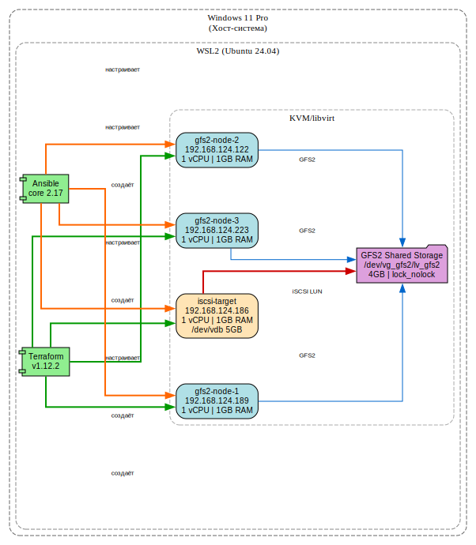

# Домашнее задание: GFS2 хранилище в KVM/libvirt

## Цель

Развернуть конфигурацию для общего хранилища с GFS2, используя Terraform и Ansible для автоматического создания и настройки виртуальных машин.

## Архитектура


### Компоненты

| Компонент | IP-адрес | Роль | Диски |
|-----------|----------|------|-------|
| **iscsi-target** | 192.168.124.186 | iSCSI Target (tgt) | vda (система), vdb (5GB общий) |
| **gfs2-node-1** | 192.168.124.189 | GFS2 клиент + LVM | vda (система), sda (iSCSI) |
| **gfs2-node-2** | 192.168.124.122 | GFS2 клиент | vda (система), sda (iSCSI) |
| **gfs2-node-3** | 192.168.124.223 | GFS2 клиент | vda (система), sda (iSCSI) |

### Поток данных
[iscsi-target] [gfs2-node-1]
│ │
├── /dev/vdb (5GB) ├── iSCSI initiator
│ └── iSCSI LUN ─────────────────┤── /dev/sda
│ │ └── LVM PV
│ │ └── VG vg_gfs2
│ │ └── LV lv_gfs2 (4GB)
│ │ └── mkfs.gfs2
│ │ └── mount /mnt/gfs2
│ │
│ [gfs2-node-2] ──────┤
│ [gfs2-node-3] ──────┘
│ │
└──────────────────┴── все узлы подключаются к одному LUN
и монтируют общую GFS2

text

### Сеть

- **Подсеть:** 192.168.124.0/24
- **Шлюз:** 192.168.124.1 (virbr1, NAT)
- **DHCP:** включён, диапазон 192.168.124.2 – 192.168.124.254
- **Тип сети:** изолированная NAT-сеть libvirt

## Окружение

| Компонент | Описание |
|-----------|----------|
| Хост-система | Windows 11 Pro с WSL2 (Ubuntu 24.04) |
| Гипервизор | KVM/libvirt внутри WSL2 |
| Terraform | v1.12.2 |
| Провайдер | dmacvicar/libvirt v0.7.1 |
| Ansible | для автоматической настройки |
| Образ ВМ | Ubuntu 22.04 LTS (KVM-ядро) |
| iSCSI | tgt (Linux SCSI target framework) |
| LVM | vg_gfs2 / lv_gfs2 (4GB) |
| Файловая система | GFS2 (lock_nolock, 3 журнала) |

## Структура проекта
gfs2-project/
├── main.tf # Terraform-конфигурация: сеть, пул, 4 ВМ, диски
├── outputs.tf # Выходные параметры
├── cloud-init-final.yaml # Настройки cloud-init (пользователи, SSH-ключ, пароль)
├── network-config.yaml # Конфигурация сети (DHCP на всех интерфейсах)
├── ansible/
│ ├── inventory.yml # Инвентарь узлов
│ └── playbook.yml # Плейбук: установка пакетов, настройка iSCSI, LVM, GFS2
├── screenshots/ # Скриншоты выполнения
├── architecture.dot # Graphviz-схема архитектуры
└── README.md # Документация

text

## Пошаговое выполнение

### Шаг 1. Подготовка окружения

Установка KVM, libvirt, Terraform, Ansible в WSL2:

```bash
sudo apt install -y qemu-kvm libvirt-daemon-system libvirt-clients bridge-utils
sudo apt install -y ansible cloud-image-utils
[Скриншот 1] — Установленные пакеты, virsh list --all, terraform --version

Шаг 2. Создание Terraform-конфигурации
Создан main.tf с ресурсами:

Сеть gfs2-network (192.168.124.0/24, DHCP)

Пул хранения default

Образ Ubuntu 22.04 cloud image

4 виртуальные машины (1 iSCSI target, 3 GFS2 nodes)

Дополнительные диски для каждой ВМ

bash
terraform init
terraform plan
terraform apply -auto-approve
Результат: 11 ресурсов создано, 4 ВМ запущены.

[Скриншот 2] — Вывод terraform apply с outputs

Шаг 3. Настройка сети и получение IP
Проблема: cloud-init ISO не активировал сеть в KVM-образе.
Решение: ручная активация через консоль + bootcmd в cloud-init.

IP-адреса ВМ:

iscsi-target: 192.168.124.186

gfs2-node-1: 192.168.124.189

gfs2-node-2: 192.168.124.122

gfs2-node-3: 192.168.124.223

[Скриншот 3] — virsh domifaddr для всех ВМ, успешный SSH

Шаг 4. Настройка iSCSI Target
На iscsi-target установлен tgt и настроен target:

bash
sudo apt install -y tgt
sudo tgtadm --lld iscsi --op new --mode target --tid 1 -T iqn.2026-06.local.gfs2:storage
sudo tgtadm --lld iscsi --op new --mode logicalunit --tid 1 --lun 1 -b /dev/vdb
sudo tgtadm --lld iscsi --op bind --mode target --tid 1 -I ALL
[Скриншот 4] — tgtadm --lld iscsi --op show

Шаг 5. Подключение iSCSI Initiators
На всех GFS2-узлах:

bash
sudo iscsiadm -m discovery -t st -p 192.168.124.186
sudo iscsiadm -m node --targetname iqn.2026-06.local.gfs2:storage -p 192.168.124.186 --login
Диск /dev/sda (5GB) появился на всех узлах.

[Скриншот 5] — lsblk на всех трёх узлах, видно /dev/sda 5G

Шаг 6. Настройка LVM
На gfs2-node-1:

bash
sudo pvcreate /dev/sda
sudo vgcreate vg_gfs2 /dev/sda
sudo lvcreate -L 4G -n lv_gfs2 vg_gfs2
Сканирование на остальных узлах:

bash
sudo pvscan --cache && sudo vgscan --cache && sudo vgchange -ay vg_gfs2
[Скриншот 6] — sudo lvdisplay, sudo vgs, sudo pvs

Шаг 7. Создание и монтирование GFS2
bash
sudo modprobe gfs2
sudo mkfs.gfs2 -p lock_nolock -j 3 /dev/vg_gfs2/lv_gfs2
sudo mount -t gfs2 /dev/vg_gfs2/lv_gfs2 /mnt/gfs2
[Скриншот 7] — df -h /mnt/gfs2 на всех трёх узлах

Шаг 8. Итоговая проверка
GFS2 примонтирована на всех трёх узлах:

text
/dev/mapper/vg_gfs2-lv_gfs2  4.0G   52M  4.0G   2% /mnt/gfs2
[Скриншот 8] — Вывод df -h, ls -la /mnt/gfs2, lsmod | grep gfs2

Возникшие сложности и их решение
№	Проблема	Причина	Решение
1	Cloud-init ISO не применялся	Несовместимость cloud-localds с правами	Пересоздан ISO с sudo, добавлен network-config
2	DHCP не выдавал адреса	Отсутствовал файл leases у dnsmasq	sudo touch /var/lib/libvirt/dnsmasq/gfs2-network.leases
3	Модуль gfs2 не найден	KVM-ядро без модуля GFS2	Установлен linux-modules-extra, загружен модуль
4	lock_dlm не работает	Требуется кластерный стек (corosync/pacemaker)	Использован lock_nolock для демонстрации GFS2
5	SSH host key changed	Пересоздание ВМ с теми же IP	ssh-keygen -R <ip> для очистки known_hosts
6	Cloud-init ждал сеть бесконечно	systemd-networkd-wait-online.service	Добавлен bootcmd для отключения ожидания
Выводы
Освоен Terraform для создания инфраструктуры из 4 ВМ с сетью и дисками

Настроен iSCSI target/initiator для предоставления общего блочного устройства

Развёрнута GFS2 — кластерная файловая система на общем LVM-томе

Автоматизирована настройка через Ansible

Получен практический опыт работы с распределёнными файловыми системами

Инструкция по воспроизведению
bash
# 1. Клонировать репозиторий
git clone <url>
cd gfs2-project

# 2. Инициализировать Terraform
terraform init
terraform import libvirt_pool.default <UUID-пула>
terraform apply -auto-approve

# 3. Получить IP адреса
virsh domifaddr iscsi-target --source arp
virsh domifaddr gfs2-node-1 --source arp
virsh domifaddr gfs2-node-2 --source arp
virsh domifaddr gfs2-node-3 --source arp

# 4. Настроить через Ansible
cd ansible
ansible-playbook -i inventory.yml playbook.yml

# 5. Проверить GFS2
ssh ubuntu@<node-ip> "df -h /mnt/gfs2"
Очистка ресурсов
bash
terraform destroy -auto-approve
